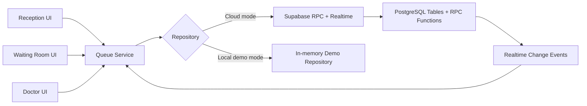

# Q-Cure

Real-time digital queue management for neighbourhood clinics.

Q-Cure replaces paper tokens with a fast receptionist workflow, an instantly updating waiting-room display, and a doctor-facing live operations cockpit. The project is built for hackathon judging: it demonstrates real-time queue orchestration, actual wait-time estimation from consultation history, and a polished SaaS-style product experience.

## Problem Statement

Most neighbourhood clinics still rely on verbal updates and paper tokens. That creates avoidable friction:

- Patients do not know how many people are ahead of them.
- Receptionists manually maintain the queue.
- Doctors lack a live view of the clinic flow.
- Wait-time expectations are inconsistent and often guessed.

Q-Cure digitizes the full loop with Supabase-backed queue operations, realtime subscriptions, and a frontend that stays synchronized without refreshes or polling.

## What the Demo Shows

- Reception can register a patient in a single action and generate sequential tokens like `T001`, `T002`, `T003`.
- The waiting-room screen updates instantly when patients are added, called, or completed.
- Estimated wait times use real completed consultation durations when history exists, and fall back to a configurable clinic default when it does not.
- Critical queue operations are modeled as RPC functions instead of raw client-side mutations.

## Tech Stack

- Frontend: React, Vite, TypeScript, TailwindCSS, React Query, React Router
- UI primitives: shadcn/ui-style component patterns with Radix Slot/Dialog
- Backend: Supabase
- Database: PostgreSQL
- Realtime: Supabase Realtime with Postgres change events
- Testing: Vitest, Testing Library
- Deployment: Vercel for frontend, Supabase Cloud for backend

## Routes

- `/reception`: receptionist dashboard for registration, queue control, analytics, and settings
- `/waiting-room`: patient-facing realtime screen optimized for phone or TV display
- `/doctor`: live doctor cockpit with consultation and queue visibility

## Architecture



### Frontend architecture

- `pages/`: route-level experiences
- `components/`: UI building blocks and dashboard modules
- `hooks/`: data-loading and realtime synchronization hooks
- `services/`: queue service and repository abstraction
- `lib/`: environment and Supabase client setup
- `types/`: queue and database types
- `utils/`: formatting and queue derivation logic

### Backend architecture

- `supabase/migrations/001_init.sql`: tables, indexes, triggers, RLS, policies
- `supabase/migrations/002_rpc_functions.sql`: queue RPC functions and wait-time calculation
- `supabase/seed.sql`: sample data for quick validation

## Folder Structure

```text
Q-Cure/
├─ src/
│  ├─ components/
│  ├─ hooks/
│  ├─ lib/
│  ├─ pages/
│  ├─ services/
│  ├─ styles/
│  ├─ test/
│  ├─ types/
│  └─ utils/
├─ supabase/
│  ├─ migrations/
│  └─ seed.sql
├─ documentation/
├─ context.md
├─ thought-process.md
└─ realtime-flow.md
```

## Wait Time Logic

Q-Cure never hardcodes wait time.

1. Calculate the average from completed consultation durations.
2. If there is no history yet, use `clinic_settings.default_consultation_time`.
3. For each waiting patient, compute:

`estimated wait = patients ahead × average consultation duration`

This logic exists in both:

- frontend derivation utilities for demo mode and presentation
- SQL RPCs for live Supabase operation

## Realtime Architecture

- Clients subscribe to `patients`, `clinic_settings`, and `queue_events`
- Queue changes are triggered by RPC functions like `add_patient()` and `call_next_patient()`
- Supabase Realtime broadcasts Postgres change events
- React Query cache is updated immediately from subscription callbacks
- No polling or manual refresh is used

## Local Development

### Quick start

```bash
npm install
npm run dev
```

The app runs immediately after install. If `VITE_SUPABASE_URL` and `VITE_SUPABASE_ANON_KEY` are not configured, Q-Cure automatically uses a built-in demo repository so the product still boots and behaves like a live queue.

### Environment variables

Create `.env` from `.env.example` when you want to connect to a real Supabase project:

```bash
VITE_SUPABASE_URL=https://your-project-id.supabase.co
VITE_SUPABASE_ANON_KEY=your-anon-key
```

## Supabase Setup

1. Create a new Supabase project.
2. Run `supabase/migrations/001_init.sql`.
3. Run `supabase/migrations/002_rpc_functions.sql`.
4. Optionally run `supabase/seed.sql`.
5. Enable Realtime for `patients`, `clinic_settings`, and `queue_events`.
6. Add the project URL and anon key to `.env`.

## Security

- Row Level Security is enabled on all public tables.
- Public clients can read queue state.
- Mutating operations are intended to run through RPC functions.
- Input validation exists in both the frontend and SQL layer.
- Queue-critical operations lock tables to reduce race-condition risk across multiple receptionists and tabs.

### Rate limiting strategy

For production hardening, deploy the Supabase operations behind an authenticated receptionist/doctor role or an Edge Function gateway with:

- per-IP request throttling
- session-aware mutation limits
- audit logging for operator actions
- bot protection for public write surfaces

## Testing

Run:

```bash
npm test
```

Covered areas:

- wait-time calculation
- historical average fallback behavior
- token generation
- call-next queue progression
- realtime subscription behavior in the demo repository
- receptionist registration interaction

## Build

```bash
npm run build
```

## Deployment

Detailed deployment instructions live in [documentation/deployment.md](/E:/study/QueueCure/documentation/deployment.md).

## Screenshots

Suggested screenshots for a submission:

- Reception dashboard overview with queue metrics
- Add-patient flow showing instant token assignment
- Waiting-room display showing live current token
- Doctor dashboard showing current patient and queue status

## Future Scope

- WhatsApp or SMS queue notifications
- multilingual patient views
- doctor-specific consultation notes integration
- appointment pre-booking and no-show handling
- branch-level multi-clinic support
- richer RBAC with Supabase Auth

## Documentation Map

- [thought-process.md](/E:/study/QueueCure/thought-process.md)
- [realtime-flow.md](/E:/study/QueueCure/realtime-flow.md)
- [documentation/deployment.md](/E:/study/QueueCure/documentation/deployment.md)
- [context.md](/E:/study/QueueCure/context.md)
