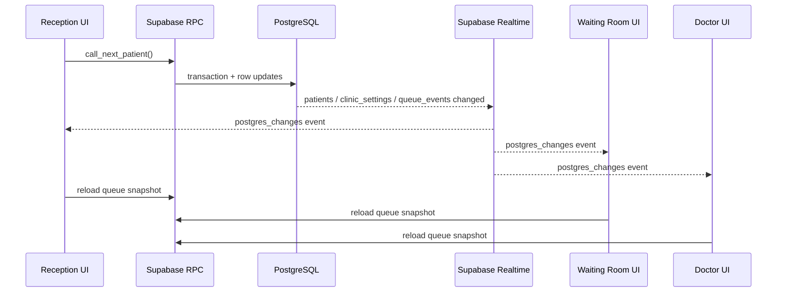
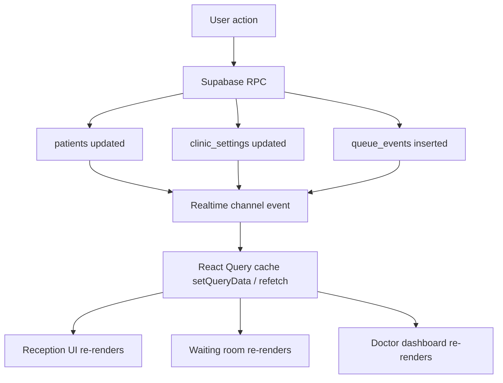

# QueueCure Realtime Flow

## Overview

QueueCure uses Supabase Realtime on Postgres change events. The application never polls for queue status. Instead, every connected screen reacts to database changes pushed over a shared channel.

## Subscribed Tables

- `patients`
- `clinic_settings`
- `queue_events`

## Update Lifecycle

## Database Change Flow

## Client Subscription Strategy

- A shared queue repository owns the realtime subscription.
- The repository subscribes to all relevant queue tables through one Supabase channel.
- Each event triggers a fresh snapshot load.
- React Query stores the snapshot under `["queue-snapshot"]`.

This approach favors consistency and clarity over micro-optimized event patching.

## Reconnect Behavior

- Supabase automatically attempts channel reconnection.
- On any new event after reconnect, the app reloads the full snapshot.
- Browser refresh is safe because the queue source of truth is persisted in PostgreSQL.

## Why Snapshot Reload Instead of Event Diffing

For a hackathon MVP, snapshot reload is the safer choice:

- fewer client-side edge cases
- easier to debug
- simpler explanation to judges
- guarantees state convergence after reconnects or missed transient events

## Demo Mode Note

When Supabase environment variables are absent, QueueCure uses the local demo repository. That demo repository mirrors the same subscription shape so the product still demonstrates realtime UX during local development.
